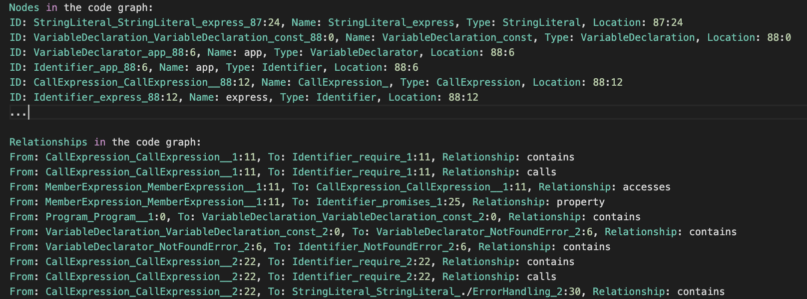
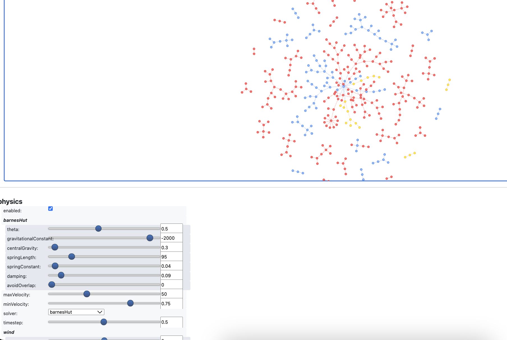

# AST Parser and Knowledge Graph Generator

## Overview

This project is an Abstract Syntax Tree (AST) parser and knowledge graph generator for JavaScript code. It takes JavaScript ASTs in JSON format and converts them into a queryable knowledge graph structure. This tool is designed to facilitate code analysis, understanding complex codebases, and potentially integrating with AI-based code assistance systems. In the current implementation, this provides an interactive representation of a codebase's structure. By visualizing nodes (representing code elements like files, classes, methods, etc.) and their relationships (such as containment or inheritance), developers can gain insights into the organization and complexity of the code.

## Features

- Parses JavaScript ASTs from JSON format
- Generates a knowledge graph representing the code structure
- Captures relationships between different code elements (e.g., function calls, class inheritance)
- Handles multiple files, creating a comprehensive graph of the entire codebase
- Provides a foundation for advanced code analysis and AI-assisted development

## Sample Visuzalization

### Sample AST Nodes and Relations


### 2D Representation of Knowledge Graph


### Interactive Graph


## How It Works

1. **AST Parsing**: The tool reads ASTs in JSON format, typically generated from JavaScript code using tools like Babel.

2. **Graph Generation**: It converts the AST into a graph structure where:
   - Nodes represent code elements (e.g., functions, classes, variables)
   - Edges represent relationships between these elements (e.g., function calls, inheritance)

3. **Multi-File Support**: The tool can process multiple files, creating a unified graph that represents the entire codebase.

4. **Relationship Mapping**: It identifies and maps various relationships in the code, such as:
   - Function calls
   - Class inheritance
   - Variable usage
   - Module imports/exports

5. **Visualization Features**:
   - **Interactive Interface**: Users can drag nodes to explore the graph dynamically.
   - **Clustering**: Nodes are grouped based on their file paths, helping to visualize module boundaries.
   - **Node Size and Color**: Nodes are sized and colored to indicate their number of connections and file associations.

6. **Technical Stack**:
   - **NetworkX**: Used for constructing the graph's data structure.
   - **Pyvis**: Provides an interactive web-based visualization interface.

## Key Components

- `CodeNode`: Represents a single node in the graph (e.g., a function, class, or variable).
- `CodeGraph`: The main graph structure that holds all nodes and relationships.
- `parse_ast()`: The core function that traverses the AST and builds the graph.
- `get_node_name()`: Helper function to generate meaningful names for AST nodes.
- `visualize_graph_2d() and visualize_graph_3d()`: Utility function to display the generated graph structure.

## Usage

1. Ensure you have a JSON file containing the AST of your JavaScript code.
2. Run the script, providing the path to your AST JSON file:

   ```
   python main.py path/to/your/ast.json
   ```

3. The script will generate a knowledge graph and print out the nodes and relationships.

## Output

The tool provides two main types of output:

1. **Nodes**: Representing individual code elements, including their type, name, and location in the source code.
2. **Relationships**: Showing how different nodes are connected (e.g., which function calls another function).

### Use Cases

- **Code Comprehension**: Quickly understand the architecture and dependencies within a codebase.
- **Refactoring Support**: Identify tightly coupled components that may benefit from refactoring.
- **Onboarding Tool**: Help new developers familiarize themselves with complex projects.

### Improvements and Future Work

1. **Enhanced Metrics Display**:
   - Integrate metrics such as node degree, betweenness centrality, and connected components directly within the visualization.

2. **Customization Controls**:
   - Provide users with controls to adjust physics settings (e.g., force strength) directly in the interface for better layout customization.

3. **Scalability Enhancements**:
   - Optimize performance for larger codebases by implementing lazy loading or hierarchical views.

4. **Integration with Development Tools**:
   - Develop plugins for popular IDEs to allow real-time visualization updates as code changes.

5. **Advanced Analysis Features**:
   - Implement features like impact analysis to predict how changes in one part of the code might affect others.

## Requirements

- Python 3.x
- JSON parsing capability (built into Python)

## Contributing

Contributions to enhance the functionality, improve efficiency, or extend the capabilities of this tool are welcome. Please submit pull requests or open issues to discuss potential improvements.

## License

[MIT License](./LICENSE)

## Conclusion

The current implementation provides a solid foundation for visualizing code structure interactively. By continuing to enhance its features and usability, this tool can become an invaluable asset for developers seeking to understand and improve their codebases efficiently.
